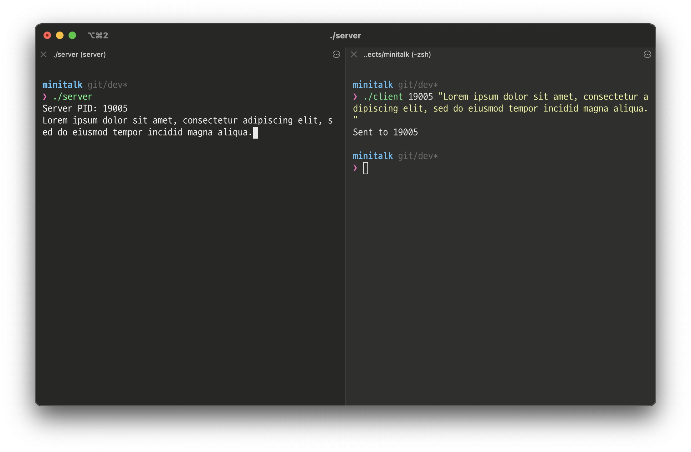

[](https://42seoul.kr/)
[![result](https://img.shields.io/badge/WIP-0/100-5cb85c?style=flat-square&logoWidth=12&logo=data:image/png;base64,iVBORw0KGgoAAAANSUhEUgAAADAAAAAwCAYAAABXAvmHAAAAAXNSR0IArs4c6QAAAylJREFUaEPtmDmLVEEUhb+LK+IG7qIibuCKYCYYOSoGomjimoggOgiKmYGhgYEMGqgYiJmIG4ig4IKGitsv8Ae4m7ocuWO108u8flWvu+030JXN9Kmqc+49devWM0b4sBHOn56Abmewl4FeBnIiIGk6cBtYCxwzs2vVU0ptIUkzgEfAmkBawFEzu1QRUVoBgfxjYHVdklzEETO77P8vpYAm5CtafgMH3U6lEyBpJuCRX5VzPH4BB0olIJB/AqyMrG4fSiNA0izAya+IJO+wp6UQkGCbam3vgL6uCyhgGxfxl7zZx64KCLbxAxvr+RryXS2jBT3/L/JdvcjaRX7YDEhaBJwB3gOnzexHQlXIhUqa69UDWJYLHgK8DZ7/VD+n5gxIWgfcB7yk+bgF7DaznwmbZUIlzQ6XVEqpbLDNsM2cpI2h65tcx+AmsKdVEYG81/nlCcHwyG/yapM1ZzADkvYBV4ExGcAbwF4z8+s7eUiaF2yzJGFypm1qMiCpH7gQ0di5wENm5o1U9ChI/k3w/Oe8jUzSd2BSHjD8fgU4bGbe0uYOSfND5BfngocA0eR9igu4C2xP2OAi0J8nQtKC0NukkH8dPJ8b+QpfFzABeABsSBBxHjieJaJg5KM8X8+xcoinhPLmZTR2DJjZiXpwwcgXIj9ooQqB8Hh+ltjOnjOzk1VruG38kvLLMHYUJl8jwP8It+RzIMW3Z4FTYc5DYGEsc+BV8PyXhDk10IZuVJITcBFeQWLH11DJRsVOaAf5hgxUWWEp4Haak0AoBeql0m/Yht4mZZFMAcFO/jnD/TwtddEcfFKdz9u76YNGkn8NcxFT8xaK/L2t5JtmoMpO6wE/nBMjSWbB2k4+SkCwUx9wDxhfUETyDRu7T/SbWNI2wFvrsbGLB9xLYLOZeaVq+4gWEDKxFbgDjItk0rHIV/ZPEhBE7AD8fZD1dqis/QLY0qnIFxYQROwErjcR0fHItyQgR8R/Ix9dhbL8LmlXyMTogPHexg9sdD8feZYyYclnoH4lSW6ngfC5b7+ZfWuVVMr8lgWkbNYJbE9AJ6KasmYvAynR6gR2xGfgD5kpEElZbxKNAAAAAElFTkSuQmCC)](https://projects.intra.42.fr/minitalk/sarchoi)

[](https://github.com/srngch/42minitalk)
[](https://github.com/srngch/42minitalk)

<details>
  <summary>Table of Contents</summary>
  <ol>
    <li><a href="#summary">Summary</a></li>
    <li><a href="#project-structure">Project Structure</a></li>
    <li><a href="#environment">Environment</a></li>
    <li><a href="#installation">Compile</a></li>
    <ul>
        <li><a href="#mandatory">Mandatory</a></li>
	</ul>
	<li><a href="#execute">Execute</a></li>
    <ul>
        <li><a href="#controls">Controls</a></li>
	</ul>
	<li><a href="#example">Example</a></li>
	<li><a href="#links">Links</a></li>
  </ol>
</details>

# minitalk

The purpose of this project is to code a small data exchange program using UNIX signals. It is an introductory project for the bigger UNIX projects that will appear later on in the cursus.

## Summary

|                      |                                                                                                                                     |
| -------------------- | ----------------------------------------------------------------------------------------------------------------------------------- |
| **Program name**     | `server`, `client`                                                                                                                           |
| **Makefile**         | `all`, `clean`, `fclean`, `re`, `server`, `client`                                                                            |
| **Client Arguments**        | Server PID, String                                                                                                              |
| **External functs.** | `write`, `signal`, `sigemptyset`, `sigaddset`, `sigaction`, `kill`, `getpid`, `malloc`, `free`, `pause`, `sleep`, `usleep`, `exit`  |
| **Libft authorized** | Yes                                                                                                                                 |

## Project Structure

```shell
./
├── includes/	# header file
├── libft/		# library for print strings
├── src/
│   ├── client.c
│   ├── server.c
│   └── util.c
├── Makefile
└── readme.md
```

## Environment

- MacOS 11.4(Big Sur, Intel)

Developed and tested in this environment.

## Compile

### Mandatory

```shell
$ git clone https://github.com/srngch/42minitalk
$ make all
```

## Execute

Run compiled executable file in the root folder. Use two terminals.

```shell
# terminal 1
$ ./server
Server PID: [server_pid]
```

```shell
# terminal 2
$ ./client [server_pid] "[string_to_send]"
```

1. Run the `server`
2. Check the `server`'s PID
3. Run the `client` with `server_pid` and `string_to_send`
4. Check the string the `server` receives from the `client`.

## Example



## Links

- [Subject - 42 Intra](https://projects.intra.42.fr/projects/minitalk)
- [Subject - 42Seoul Translation](https://github.com/42seoul-translation/subject_ko/blob/master/minitalk/minitalk.md)
